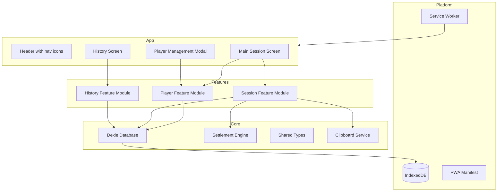
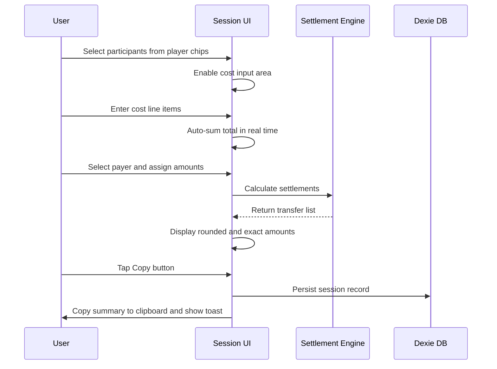
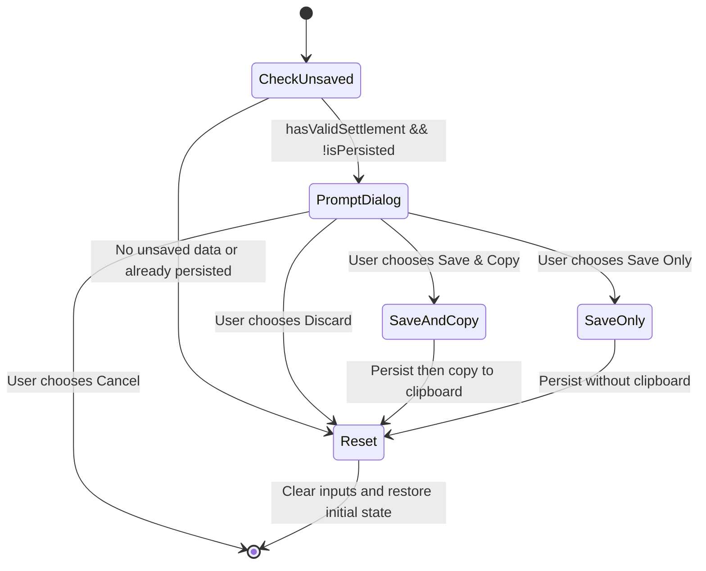
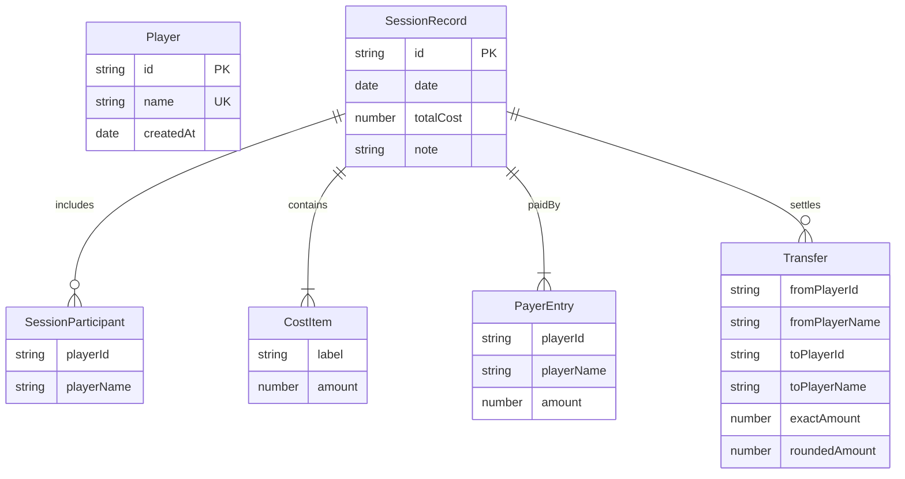

# Badminton Cost Splitter — Technical Design

## Overview

**Purpose**: This feature delivers a Progressive Web App for splitting badminton session costs among players, enabling users to complete cost-splitting in under 10 seconds with a single-screen design philosophy.

**Users**: Recreational badminton players use the app immediately after sessions to split court fees, shuttlecock costs, and other expenses. The app is designed for mobile use at the venue, often with poor connectivity.

**Impact**: Greenfield application with no existing system to modify.

### Goals
- Single-screen cost splitting flow completing in under 10 seconds of user interaction
- Fully offline-capable PWA installable from home screen
- Optimal debt simplification minimizing total settlement transfers
- VND-aware rounding with exact amount transparency

### Non-Goals
- Multi-currency support (VND only)
- User authentication or cloud sync
- Real-time collaboration between multiple devices
- Payment integration (settlements are informational only)
- Recurring/scheduled sessions

## Architecture

### Architecture Pattern & Boundary Map

**Selected pattern**: Hybrid feature-based + layered architecture. Each feature module (players, session, history) is internally organized as UI → hooks → services → data. A shared core provides the database instance, types, and utility functions.



**Architecture Integration**:
- Domain boundaries: Player management, Session (cost input + settlement), and History are isolated feature modules
- Shared core: Database schema, settlement algorithm, type definitions, and clipboard service are shared across features
- New components rationale: Each feature module encapsulates its own UI, hooks, and logic; the settlement engine is extracted as a pure function for testability
- Navigation model: React Router v6 with two routes — `/` (main session screen, includes PlayerManager modal) and `/history` (lazy-loaded HistoryScreen with nested SessionDetail). The "single-screen design" philosophy applies to the session flow within `/` (no page navigation during cost splitting); history is a separate navigable route with browser back-button support. PlayerManager opens as a modal overlay on `/` only — it is **not** accessible from `/history`. This scopes all player management to the session screen, avoiding reconciliation concerns while viewing history.

### Technology Stack

| Layer | Choice / Version | Role in Feature | Notes |
|-------|------------------|-----------------|-------|
| Frontend | React 19 + TypeScript 5.9 | Component framework with strong typing | Hooks-based architecture; see `research.md` for framework comparison |
| Build Tool | Vite 8 | Dev server, HMR, production bundling | Tree-shaking and code splitting for <2s load target |
| PWA | vite-plugin-pwa | Service worker generation, precaching, manifest | Workbox-powered; prompt update strategy |
| Styling | Tailwind CSS 3 | Mobile-first responsive utility classes | Purged in production for minimal bundle |
| Data / Storage | Dexie.js v4 | IndexedDB wrapper with reactive queries | `useLiveQuery` for real-time UI updates |
| Routing | React Router v7 (lazy) | History screen navigation + back-navigation | Lazy-loaded `HistoryScreen` route for code splitting; "single-screen" applies to session flow only |
| Testing | Vitest + Testing Library | Unit and integration testing | Vite-native test runner |

## System Flows

### Main Session Flow



### New Session Reset Flow



## Requirements Traceability

| Requirement | Summary | Components | Interfaces | Flows |
|-------------|---------|------------|------------|-------|
| 1.1, 1.2, 1.3, 1.4, 1.5 | Player CRUD with validation | PlayerManager, PlayerService | PlayerService | — |
| 2.1, 2.2, 2.3, 2.4, 2.5 | Player selection for session | PlayerSelector | useSessionForm | Main Session |
| 3.1, 3.2, 3.3, 3.4, 3.5, 3.6, 3.7 | Multi-item cost input | CostInputPanel | useSessionForm | Main Session |
| 4.1, 4.2 | Optional session note | SessionNoteInput | useSessionForm | Main Session |
| 5.1, 5.2, 5.3, 5.4, 5.5, 5.6, 5.7 | Who-paid assignment | PayerPanel | useSessionForm | Main Session |
| 6.1, 6.2, 6.3, 6.4, 6.5 | Real-time settlement calculation | SettlementEngine, SettlementDisplay | useSessionDerived, SettlementEngine | Main Session |
| 7.1, 7.2, 7.3 | Copy settlement to clipboard | CopyButton, ClipboardService | ClipboardService | Main Session |
| 8.1, 8.2, 8.3, 8.4, 8.5 | Session persistence and history | HistoryList, SessionDetail, SessionService | SessionService | — |
| 9.1, 9.2, 9.3 | Performance targets | All components | — | — |
| 10.1, 10.2, 10.3, 10.4 | Mobile-first responsive design | All UI components | — | — |
| 11.1, 11.2, 11.3 | New session reset | NewSessionButton | useSessionForm | Reset Flow |
| 12.1, 12.2, 12.3 | Offline support | ServiceWorker, Dexie DB | — | — |

## Components and Interfaces

| Component | Domain/Layer | Intent | Req Coverage | Key Dependencies | Contracts |
|-----------|--------------|--------|--------------|------------------|-----------|
| AppDatabase | Core/Data | Dexie database schema and instance | All | Dexie.js (P0) | State |
| SettlementEngine | Core/Logic | Calculate optimal debt settlements | 6.1-6.5 | None (P0 pure function) | Service |
| ClipboardService | Core/Service | Copy text to system clipboard | 7.1-7.3 | Clipboard API (P0) | Service |
| PlayerService | Player/Data | CRUD operations for player records | 1.1-1.5 | AppDatabase (P0) | Service |
| PlayerManager | Player/UI | Player list management modal | 1.1-1.5 | PlayerService (P0) | — |
| PlayerSelector | Session/UI | Chip-based player selection | 2.1-2.5 | PlayerService (P0), SessionState (P0) | — |
| CostInputPanel | Session/UI | Multi-item cost entry with auto-sum | 3.1-3.7 | SessionState (P0) | — |
| SessionNoteInput | Session/UI | Optional free-text note field | 4.1-4.2 | SessionState (P0) | — |
| PayerPanel | Session/UI | Payer selection and amount assignment | 5.1-5.7 | SessionState (P0) | — |
| SettlementDisplay | Session/UI | Display settlement transfers | 6.1-6.4 | SettlementEngine (P0), SessionState (P0) | — |
| CopyButton | Session/UI | One-tap copy with save trigger | 7.1-7.3, 8.1 | ClipboardService (P0), SessionService (P0) | — |
| ClipboardFallbackModal | Session/UI | Selectable text fallback when Clipboard API fails | 7.1, 7.2 | None | — |
| NewSessionButton | Session/UI | Reset flow with unsaved data guard | 11.1-11.3 | SessionState (P0) | — |
| usePlayerList | Player/Logic | Reactive hook for live player list via useLiveQuery | 1.1-1.3, 2.1 | AppDatabase (P0) | State |
| useSessionForm | Session/Logic | React hook managing session form state and actions | 2-5, 11 | None | State |
| useSessionDerived | Session/Logic | React hook computing derived values and settlement | 6.1, 3.3, 5.4 | SettlementEngine (P0) | State |
| SessionService | History/Data | Persist and query session records | 8.1-8.5 | AppDatabase (P0) | Service |
| useSessionList | History/Logic | Reactive hook for live session list via useLiveQuery | 8.2-8.3 | AppDatabase (P0) | State |
| HistoryList | History/UI | Session cards sorted by date | 8.2-8.3, 8.5 | useSessionList (P0) | — |
| SessionDetail | History/UI | Full session detail view | 8.4 | SessionService (P0) | — |

### Core / Data

#### AppDatabase

| Field | Detail |
|-------|--------|
| Intent | Provide typed Dexie database instance with schema versioning |
| Requirements | 1.1, 8.1, 12.1, 12.2 |

**Responsibilities & Constraints**
- Single database instance shared across all features
- Schema versioning for future migrations
- All data persisted to IndexedDB; no remote dependencies

**Dependencies**
- External: Dexie.js v4 — IndexedDB abstraction (P0)

**Contracts**: State [x]

##### State Management
- State model: Dexie database with tables for `players` and `sessions`
- Persistence & consistency: IndexedDB transactions guarantee atomic writes
- Concurrency strategy: Single-tab usage assumed; Dexie handles IndexedDB locking

### Core / Shared Types

```typescript
// Discriminated union for service operation results — avoids thrown errors,
// enables exhaustive pattern matching at call sites
type Result<T, E extends string> =
  | { ok: true; value: T }
  | { ok: false; error: E };
```

### Core / Logic

#### SettlementEngine

| Field | Detail |
|-------|--------|
| Intent | Calculate optimal settlement transfers from session data |
| Requirements | 6.1, 6.2, 6.3, 6.4, 6.5 |

**Responsibilities & Constraints**
- Pure function with no side effects or external dependencies
- Minimize total number of transfers (greedy net-balance algorithm)
- Handle VND rounding (nearest 1,000) with exact amounts preserved
- Handle solo-session edge case (single participant)

**Dependencies**
- None (pure computation)

**Contracts**: Service [x]

##### Service Interface
```typescript
interface Transfer {
  fromPlayerId: string;
  fromPlayerName: string;
  toPlayerId: string;
  toPlayerName: string;
  exactAmount: number;
  roundedAmount: number;
}

interface SettlementResult {
  transfers: Transfer[];
  isSoloSession: boolean;
}

interface SettlementInput {
  participants: Array<{ id: string; name: string }>;
  totalCost: number;
  payers: Array<{ playerId: string; amount: number }>;
}

function calculateSettlement(input: SettlementInput): SettlementResult;
```
- Preconditions: `participants.length >= 1`, `totalCost > 0`, sum of `payers[].amount === totalCost`
- Postconditions: Sum of all `transfer.exactAmount` values equals the total debt; number of transfers is minimized
- Invariants: No transfer has `exactAmount <= 0`; `roundedAmount = Math.round(exactAmount / 1000) * 1000` (round to **nearest** 1,000 VND per Req 6.2)

**Implementation Notes**
- Algorithm: Compute net balance per participant (paid minus fair share), iteratively match largest creditor with largest debtor
- Validation: Caller must ensure payer amounts sum to total cost before invocation
- Rounding strategy: Each transfer is independently rounded to the nearest 1,000 VND. No sum-correction is applied — the sum of rounded transfers may differ slightly from the total cost due to rounding. This is acceptable because: (a) exact amounts are always shown as sub-text beneath rounded figures (Req 6.3), providing full transparency; (b) applying sum-correction to a single transfer would feel unfair to that person; (c) the maximum per-transfer rounding error is 500 VND, which is negligible for the target use case.

### Core / Service

#### ClipboardService

| Field | Detail |
|-------|--------|
| Intent | Copy formatted settlement summary to system clipboard |
| Requirements | 7.1, 7.2 |

**Responsibilities & Constraints**
- Format settlement transfers as human-readable Vietnamese text using the defined template
- Use Clipboard API (`navigator.clipboard.writeText`)
- Always return the formatted text alongside the success/failure status, so the UI can display it in a fallback modal on failure

**Dependencies**
- External: Clipboard API — browser-native clipboard access (P0)

**Contracts**: Service [x]

##### Service Interface
```typescript
interface CopyResult {
  success: boolean;
  text: string;
}

interface ClipboardService {
  copySettlementSummary(
    transfers: Transfer[],
    totalCost: number,
    costItems: Array<{ label: string; amount: number }>,
    participants: Array<{ id: string; name: string }>,
    sessionNote: string | null,
    date: Date
  ): Promise<CopyResult>;
}
```
- Preconditions: Secure context (HTTPS/localhost); called within user gesture handler
- Postconditions: `text` always contains the formatted summary; `success` indicates whether clipboard write succeeded
- On failure: caller receives `{ success: false, text }` and displays fallback modal

##### Clipboard Text Format
The formatted text follows this template for sharing via messaging apps (Zalo, Messenger):

```
🏸 Cầu lông - {DD/MM/YYYY}
{sessionNote — included only if non-empty}
💰 Tổng: {totalCost}đ ({item1Label}: {amount1}đ, {item2Label}: {amount2}đ, ...)
👥 {participantCount} người chơi

💸 Kết quả:
- {fromName} → {toName}: {roundedAmount}đ
- {fromName} → {toName}: {roundedAmount}đ
```

Example output:
```
🏸 Cầu lông - 28/03/2026
Sân Tân Bình
💰 Tổng: 500,000đ (Sân: 300,000đ, Cầu: 80,000đ, Nước: 120,000đ)
👥 5 người chơi

💸 Kết quả:
- Nam → Bách: 67,000đ
- Huy → Bách: 67,000đ
- Long → Bách: 67,000đ
```

**Implementation Notes**
- Integration: Use `navigator.clipboard.writeText()`; catch errors and return `{ success: false, text }`
- Fallback: On clipboard failure (in-app browsers, missing permissions), the UI displays the text in a selectable modal so the user can manually select-all and copy
- Validation: All amounts formatted with `Intl.NumberFormat('vi-VN')` and VND rounding applied
- Risks: In-app browsers (Zalo, Facebook) may lack secure context for Clipboard API; the fallback modal mitigates this

### Player / Data

#### PlayerService

| Field | Detail |
|-------|--------|
| Intent | CRUD operations for player records with validation |
| Requirements | 1.1, 1.2, 1.3, 1.4, 1.5 |

**Responsibilities & Constraints**
- Enforce unique player names (case-insensitive comparison)
- Reject empty or whitespace-only names
- Cascade considerations: deleting a player does not affect historical session records (sessions store player snapshots)
- Active session reconciliation: when a player is deleted, `useSessionForm` shall reactively remove that player from `selectedPlayerIds`, `selectedPayerIds`, and `payerEntries` via Dexie's `useLiveQuery` — when the player list changes, the session form reconciles its selections to prevent stale references. Reconciliation rules:
  - If reconciliation removes the last selected participant, reset to no participants and disable cost input
  - If reconciliation removes the last selected payer, reset payer state to no payers selected and disable settlement display
  - If reconciliation reduces payers from multiple to exactly one, auto-fill the remaining payer's amount with total cost (consistent with Req 5.2)
  - If reconciliation removes a single auto-filled payer, clear the auto-fill and disable settlement
  - **UI feedback**: When reconciliation alters the active session state (removes participant or payer), display a brief toast notification: "{PlayerName} was removed from current session" so the user understands why the form changed
- Editing a player name does not retroactively update historical session records; sessions store point-in-time name snapshots

**Dependencies**
- Inbound: PlayerManager, PlayerSelector — UI consumers (P0)
- Outbound: AppDatabase — data persistence (P0)

**Contracts**: Service [x]

##### Service Interface
```typescript
interface Player {
  id: string;
  name: string;
  createdAt: Date;
}

interface PlayerService {
  addPlayer(name: string): Promise<Result<Player, "DUPLICATE_NAME" | "EMPTY_NAME">>;
  updatePlayer(id: string, name: string): Promise<Result<Player, "DUPLICATE_NAME" | "EMPTY_NAME" | "NOT_FOUND">>;
  deletePlayer(id: string): Promise<Result<void, "NOT_FOUND">>;
  getAllPlayers(): Promise<Player[]>;
}

// Reactive hook wrapper — uses Dexie useLiveQuery for live UI updates
function usePlayerList(): Player[];  // returns live-updating player array; re-renders on DB changes
```
- Preconditions: `name` is trimmed before validation
- Postconditions: Database state reflects the operation; `usePlayerList` consumers re-render via `useLiveQuery`
- Invariants: No two players share the same name (case-insensitive)
- Service/Hook boundary: `PlayerService` methods are async, imperative operations (CRUD). `usePlayerList()` is a reactive hook wrapping `useLiveQuery(db.players.toArray())` for UI consumption. Components use `usePlayerList()` for reads and `PlayerService` for writes.

### Session / Logic

#### Session Hooks (useSessionForm + useSessionDerived)

| Field | Detail |
|-------|--------|
| Intent | Manage session form state (useSessionForm) and compute derived values (useSessionDerived) |
| Requirements | 2.1-2.5, 3.1-3.7, 4.1-4.2, 5.1-5.7, 6.1, 11.1-11.3 |

**Responsibilities & Constraints**
- `useSessionForm`: Owns form state (participants, cost items, payers, note) and mutation actions. Enforces maximum 10 cost line items. Handles new session reset with unsaved-data guard.
- `useSessionDerived`: Takes form state as input, computes auto-sum total, payer amount validation, and settlement result in real time (<100ms). Calls SettlementEngine as a pure dependency.
- Splitting these hooks keeps each under ~200 lines and establishes a clean seam between state mutation and computation.

**Dependencies**
- `useSessionForm`: Accepts `players: Player[]` parameter (from `usePlayerList()`) for active session reconciliation when players are deleted (P0)
- `useSessionDerived`: SettlementEngine — settlement calculation (P0)

**Contracts**: State [x]

##### State Management
```typescript
interface CostItem {
  id: string;
  label: string;
  amount: number | null;
}

interface PayerEntry {
  playerId: string;
  amount: number | null;
}

interface SessionFormState {
  selectedPlayerIds: Set<string>;
  costItems: CostItem[];
  sessionNote: string;
  selectedPayerIds: Set<string>;
  payerEntries: PayerEntry[];
  isCopied: boolean;
  isPersisted: boolean;
}

interface SessionFormActions {
  togglePlayer(playerId: string): void;
  selectAllPlayers(): void;
  deselectAllPlayers(): void;
  addCostItem(): void;
  updateCostItem(id: string, field: "label" | "amount", value: string | number): void;
  removeCostItem(id: string): void;
  togglePayer(playerId: string): void;
  updatePayerAmount(playerId: string, amount: number): void;
  setSessionNote(note: string): void;
  resetSession(): void;
  markCopied(): void;
  markPersisted(): void;
}

// useSessionForm — accepts live player list for reconciliation
function useSessionForm(players: Player[]): UseSessionFormReturn;

interface UseSessionFormReturn {
  state: SessionFormState;
  actions: SessionFormActions;
}

interface SessionDerived {
  totalCost: number;
  payerTotal: number;
  isPayerAmountValid: boolean;
  hasValidSettlement: boolean;
  settlementResult: SettlementResult | null;
}

// useSessionDerived return type
// Input: SessionFormState; Output: SessionDerived
function useSessionDerived(state: SessionFormState, participants: Array<{ id: string; name: string }>): SessionDerived;
```
- Persistence: In-memory only; persisted to IndexedDB when Copy button is tapped
- Consistency: All derived values (totalCost, payerTotal, isPayerAmountValid, hasValidSettlement, settlementResult) are recomputed synchronously on **any** `SessionFormState` change via `useMemo` with full state as dependency. This means reconciliation-triggered state changes (player deletion removing a participant/payer) automatically cascade into derived recomputation — no additional subscription or listener is needed. The chain is: `usePlayerList()` change → `useEffect` reconciles `SessionFormState` → React re-render → `useMemo` in `useSessionDerived` recomputes → UI reflects updated settlement.
- Concurrency: Single-threaded React state; no race conditions. Reconciliation and recomputation occur within the same render cycle, so stale settlement data is never displayed.
- Invariant: `isCopied` tracks whether the current results have been copied to clipboard — any modification to session inputs resets `isCopied` to `false` (for UI purposes: re-enabling the copy button)
- Invariant: `isPersisted` tracks whether the **current** session form state has been saved to IndexedDB — set to `true` by `markPersisted()` when session is saved. Unlike `isCopied`, any modification to session inputs after persistence resets `isPersisted` to `false`, because the modified state represents a new unsaved logical session that differs from what was persisted. This flag gates the unsaved-data guard in `resetSession()`.
- Guard condition: `resetSession()` prompts "Copy & Save / Discard / Cancel" when `hasValidSettlement && !isPersisted`. If `isPersisted === true`, reset proceeds without prompt (the session is already saved, edits after save are treated as a new session draft).
- Invariant: `selectedPayerIds` is always a subset of `selectedPlayerIds` — if a participant is deselected or removed by reconciliation, they are also removed from payers
- Invariant: Player deletion reconciliation is driven by a `useEffect` that watches the `usePlayerList()` result and intersects it with current `selectedPlayerIds` / `selectedPayerIds`, applying the reconciliation rules defined in PlayerService

### History / Data

#### SessionService

| Field | Detail |
|-------|--------|
| Intent | Persist and query session records |
| Requirements | 8.1, 8.2, 8.3, 8.4, 8.5 |

**Responsibilities & Constraints**
- Store full session snapshots (participants, costs, payers, settlements, note, date)
- Query sessions sorted by date descending
- Delete sessions with confirmation (UI responsibility)

**Dependencies**
- Outbound: AppDatabase — data persistence (P0)

**Contracts**: Service [x]

##### Service Interface
```typescript
interface SessionRecord {
  id: string;
  date: Date;
  participants: Array<{ id: string; name: string }>;
  costItems: Array<{ label: string; amount: number }>;
  totalCost: number;
  payers: Array<{ playerId: string; playerName: string; amount: number }>;
  transfers: Transfer[];
  note: string | null;
}

interface SessionService {
  saveSession(session: Omit<SessionRecord, "id">): Promise<string>;
  getAllSessions(): Promise<SessionRecord[]>;
  getSession(id: string): Promise<SessionRecord | null>;
  deleteSession(id: string): Promise<void>;
}

// Reactive hook wrapper — uses Dexie useLiveQuery for live UI updates
function useSessionList(): SessionRecord[];  // returns live-updating session array sorted by date desc
```
- Preconditions: Session data is validated before persistence
- Postconditions: `useSessionList` consumers (HistoryList) re-render via `useLiveQuery` on changes
- Service/Hook boundary: `SessionService` methods are async, imperative operations. `useSessionList()` is a reactive hook wrapping `useLiveQuery(db.sessions.orderBy('date').reverse().toArray())` for UI consumption. Components use `useSessionList()` for reads and `SessionService` for writes.

### Session / UI Components (Summary-only)

**PlayerSelector** — Displays all players as tappable chips with toggle selection. Shows active count. Provides Select All / Deselect All toggle. Disables cost input when no players selected (2.1-2.5).

**CostInputPanel** — Renders cost line items with label + amount fields. "Add More" button appends rows (hidden at 10 items). Auto-sums total in real time. Validates positive numeric amounts (3.1-3.7).

**SessionNoteInput** — Optional free-text input displayed alongside cost input area (4.1-4.2).

**PayerPanel** — Displays selected participants as selectable payers. Auto-fills single payer with total. Shows individual amount fields for multiple payers. Validates payer total matches session total with red warning on mismatch (5.1-5.7).

**SettlementDisplay** — Renders transfer list with rounded amounts (nearest 1,000 VND) and exact amounts as sub-text. Shows "Solo session — no debts to settle" for single participant (6.1-6.4).

**CopyButton** — Enabled only when settlement is valid. Deduplication guard: if `isPersisted === true`, skip persistence and only attempt clipboard copy (since `isPersisted` resets to `false` on any input change, this safely prevents duplicate saves). Otherwise, execution order: (1) persist session via SessionService and set `isPersisted = true` **first**, (2) then attempt clipboard copy via ClipboardService. This ensures the session is always saved regardless of clipboard outcome. Shows toast "Saved & Copied" on full success (or "Copied" if already persisted). If clipboard copy fails, still shows toast "Session saved" and opens ClipboardFallbackModal for manual copy (7.1-7.3, 8.1).

**ClipboardFallbackModal** — Receives `text: string` prop. Displays the settlement summary in a read-only, selectable `<textarea>` so users in in-app browsers (Zalo, Facebook Messenger) can manually select-all and copy. Provides a "Close" button. Opened by CopyButton when `ClipboardService.copySettlementSummary()` returns `{ success: false }` (7.1, 7.2).

**NewSessionButton** — Accessible from main screen. Guard condition: prompts when `hasValidSettlement && !isPersisted` with three options: "Save & Copy" (persist + clipboard), "Save Only" (persist without clipboard — for users who announce debts verbally), and "Discard" (lose data). Cancel dismisses the dialog. If session was already persisted (even if inputs were modified after), the modified state is treated as a new draft — `isPersisted` was reset to `false` on input change, so the guard activates for the new unsaved draft. Clears all inputs (including `isCopied` and `isPersisted`) and resets to participant selection (11.1-11.3).

### History / UI Components (Summary-only)

**HistoryList** — Displays session cards sorted by date (newest first) with date, total cost, and participant names. Supports swipe-to-delete or delete button with confirmation dialog (8.2-8.3, 8.5).

**SessionDetail** — Master-detail view showing all cost items, payer breakdown, settlement transfers, and note for a selected session (8.4).

## Data Models

### Domain Model



**Business Rules & Invariants**:
- Player names are unique (case-insensitive)
- Session `totalCost` equals sum of `CostItem.amount` values
- Sum of `PayerEntry.amount` equals `totalCost`
- Sessions store participant name snapshots (not references) to preserve history accuracy

### Logical Data Model

**Dexie Schema Definition**:

```typescript
interface AppSchema {
  players: {
    key: string;        // UUID generated by crypto.randomUUID()
    indexes: ["name"];  // unique index for duplicate detection
  };
  sessions: {
    key: string;        // UUID generated by crypto.randomUUID()
    indexes: ["date"];  // for sorted history queries
  };
}

// Dexie schema string (no ++, so Dexie does NOT auto-generate keys)
// db.version(1).stores({
//   players: "id, &name",
//   sessions: "id, date"
// });
```

**ID Generation Strategy**:
- Use `crypto.randomUUID()` (browser-native, available in all secure contexts — HTTPS/localhost)
- IDs are generated by the service layer (`PlayerService`, `SessionService`) before calling `db.table.add()`
- Dexie schema uses `"id"` (not `"++id"`) as the primary key — no auto-increment, string keys expected

**Structure**:
- `players` table: Flat records with `id`, `name`, `createdAt`
- `sessions` table: Denormalized documents embedding participants, costItems, payers, and transfers as arrays within the session record
- Denormalized design chosen because: sessions are immutable after creation, no cross-session queries on embedded data, and it simplifies offline reads

**Consistency & Integrity**:
- Transaction boundaries: Player operations are single-table transactions; session save is a single-table atomic write
- No cascading deletes: Deleting a player does not affect stored sessions (sessions contain name snapshots)
- No temporal versioning required (sessions are immutable records)

## Error Handling

### Error Strategy
Validation-first approach: validate all inputs at the UI boundary before computation. Settlement engine receives only pre-validated data.

### Error Categories and Responses

**User Errors**:
- Empty/duplicate player name → inline field-level validation message
- Zero/negative cost amount → field-level error, item excluded from total
- Payer amount mismatch → prominent red warning banner, settlement and copy disabled
- No participants selected → message "Please select players before calculating", cost input disabled
- Clipboard API failure (in-app browser, missing permissions) → display settlement text in a selectable modal for manual copy; session still persisted

**Business Logic Errors**:
- Solo session → friendly message instead of empty settlement (not an error state)
- Maximum cost items reached → "Add More" button hidden (not an error state)
- Uncopied results on reset → confirmation dialog with three options

### Monitoring
- Client-side only; no server-side monitoring
- Console warnings for Clipboard API failures; fallback modal displayed to user
- Service worker update notifications via toast

## Testing Strategy

### Unit Tests
- SettlementEngine: Various group sizes (1, 2, 5, 10 players), single/multiple payers, VND rounding edge cases
- PlayerService: Add/edit/delete, duplicate detection, empty name validation
- useSessionForm + useSessionDerived hooks: State transitions, derived value computation, reset flow, isCopied resets to false when any input is modified after copy, isPersisted independent of input edits, active session reconciliation when player is deleted (including: delete last payer resets payer state, delete sole auto-filled payer disables settlement, multi-to-single payer triggers auto-fill)
- VND formatting utility: Rounding, locale formatting, exact vs rounded display

### Integration Tests
- Full session flow: Select players → enter costs → select payer → verify settlement → copy → verify persistence
- Player management: Add player → verify appears in selector → delete → verify removed
- History flow: Complete session → navigate to history → verify card → open detail → verify data

### E2E/UI Tests
- Happy path: 3 players, 1 cost item, 1 payer, copy result (under 10 seconds interaction)
- Multiple payers with amount mismatch warning
- New session reset with unsaved data prompt
- History navigation and session detail view
- Offline: Complete full flow while disconnected

## Optional Sections

### Performance & Scalability
- **Load target**: Interactive within 2 seconds on standard mobile connection (Req 9.2)
- **Interaction target**: All derived values update within 100ms (Req 9.3)
- **Bundle strategy**: Vite code splitting; React Router lazy import for `/history` route; Tailwind CSS purge
- **Data scale**: Designed for hundreds of sessions; IndexedDB handles this without concern
- **Measurement**: Lighthouse PWA audit; Web Vitals (LCP, FID, CLS) via development profiling
